<div align="center">


<br>

<a href="https://www.linkedin.com/in/devansh-patel-5ab00a219/"></a>
<a href="https://tryhackme.com/p/ByteShell"></a>
<a href="https://v3n0m.medium.com/"></a>
<a href="https://github.com/D3v4nshPat3l?tab=repositories"></a>

<br>


<a href="https://github.com/D3v4nshPat3l?tab=followers"></a>


</div>


<h2><samp>&#9608;&#9617;&nbsp;&nbsp;01 &#8212; IDENTITY</samp></h2>


I build tooling that turns raw reconnaissance into findings someone can actually **act on** — and I write the report that proves it. Most of my work sits at the seam between *automation* and *evidence*: collect broadly, validate ruthlessly, document so it reproduces on the first try.

- **Break it** — web exploitation, auth/authz logic, API surface, misconfiguration, Linux privesc.
- **Automate it** — recon pipelines, enrichment, triage, and reporting that survive being run twice.
- **Prove it** — reproduction steps, captured evidence, false-positive elimination, severity that holds up.
- **Fix it** — findings translated into config, code, and process changes, not just a ticket.

> Scoped, authorized testing only. Every tool here exists to make defensive work faster.


<h2><samp>&#9608;&#9617;&nbsp;&nbsp;02 &#8212; OPERATING PROCEDURE</samp></h2>


| Phase | What actually happens |
| :--- | :--- |
| **Scope** | Confirm boundaries, permission, and assumptions in writing *before* a single packet leaves. |
| **Recon** | Passive and active collection — WHOIS, DNS, certificate transparency, archives, exposed surface. |
| **Enumerate** | Map services, endpoints, parameters, auth flows, and trust relationships into something queryable. |
| **Exploit** | Bounded, non-destructive validation. Confirm the path, never wander outside the agreed blast radius. |
| **Validate** | Reproduce twice, strip false positives, capture the evidence that makes it undeniable. |
| **Document** | Steps to reproduce, impact, affected assets, severity rationale, and the raw artifacts. |
| **Report** | Written for two audiences at once: the engineer who fixes it and the person who funds the fix. |
| **Harden** | Turn each finding into a concrete configuration, code, or process change — then re-test it. |


<h2><samp>&#9608;&#9617;&nbsp;&nbsp;03 &#8212; FIELD PROJECTS</samp></h2>

<table>
<tr>
<td width="50%" valign="top">
<a href="https://github.com/D3v4nshPat3l/ReconTitan"></a>
</td>
<td width="50%" valign="top">
<a href="https://github.com/D3v4nshPat3l/Dork-Ripper"></a>
</td>
</tr>
<tr>
<td width="50%" valign="top">
<a href="https://github.com/D3v4nshPat3l/HexForgeStudio"></a>
</td>
<td width="50%" valign="top">
<a href="https://github.com/D3v4nshPat3l/Interview-Hub"></a>
</td>
</tr>
</table>

<details>
<summary><samp><b>&#9656;&nbsp; SUPPORTING REPOSITORIES</b></samp></summary>

<br>

| Repository | What it is | Domain |
| :--- | :--- | :--- |
| [**Linux-CIS-Hardening-Auditor**](https://github.com/D3v4nshPat3l/Linux-CIS-Hardening-Auditor) | Bash CLI auditing Linux against **104 CIS Benchmark controls** — filesystems, services, networking, logging, SSH, accounts. | Hardening |
| [**Secure-QR-Code-Generator**](https://github.com/D3v4nshPat3l/Secure-QR-Code-Generator) | Input-validated QR generator for text, URL, phone, SMS, email, WhatsApp, Wi-Fi, vCard and UPI payloads. | Tooling |
| [**Port-Swigger-Labs-Solved**](https://github.com/D3v4nshPat3l/Port-Swigger-Labs-Solved) | Solved PortSwigger Web Security Academy labs, each with the reasoning — not just the payload. | Web Security |
| [**RingZero-CTF-Writeups**](https://github.com/D3v4nshPat3l/RingZero-CTF-Writeups) | Deep, step-by-step RingZer0 CTF writeups covering the dead ends as well as the solution. | CTF |
| [**Pico-CTF-Writeups**](https://github.com/D3v4nshPat3l/Pico-CTF-Writeups) | picoCTF challenge writeups across web, crypto, forensics and reversing. | CTF |

</details>


<h2><samp>&#9608;&#9617;&nbsp;&nbsp;04 &#8212; ARSENAL</samp></h2>


<table>
<tr><td align="right" width="170"><samp><b>LANGUAGES</b></samp></td><td>


</td></tr>

<tr><td align="right"><samp><b>WEB &amp; API</b></samp></td><td>


</td></tr>

<tr><td align="right"><samp><b>INFRA &amp; DATA</b></samp></td><td>


</td></tr>

<tr><td align="right"><samp><b>PLATFORMS</b></samp></td><td>


</td></tr>

<tr><td align="right"><samp><b>RECON &amp; OSINT</b></samp></td><td>


</td></tr>

<tr><td align="right"><samp><b>WEB SECURITY</b></samp></td><td>


</td></tr>

<tr><td align="right"><samp><b>EXPLOITATION</b></samp></td><td>


</td></tr>

<tr><td align="right"><samp><b>FORENSICS &amp; RE</b></samp></td><td>


</td></tr>

<tr><td align="right"><samp><b>BLUE TEAM</b></samp></td><td>


</td></tr>

<tr><td align="right"><samp><b>LABS</b></samp></td><td>


</td></tr>
</table>


<h2><samp>&#9608;&#9617;&nbsp;&nbsp;05 &#8212; TELEMETRY</samp></h2>

<div align="center">

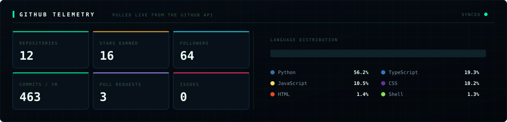

<br>

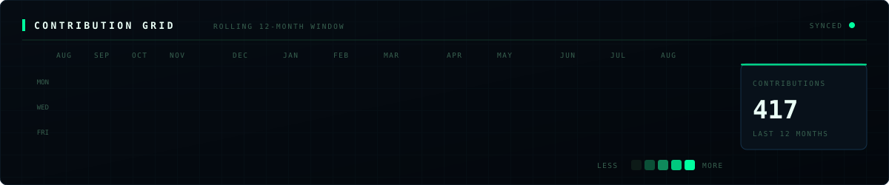

<br>

<picture>
  <source media="(prefers-color-scheme: dark)" srcset="https://raw.githubusercontent.com/D3v4nshPat3l/D3v4nshPat3l/output/github-snake-dark.svg" />
  <source media="(prefers-color-scheme: light)" srcset="https://raw.githubusercontent.com/D3v4nshPat3l/D3v4nshPat3l/output/github-snake.svg" />
  
</picture>

</div>


<h2><samp>&#9608;&#9617;&nbsp;&nbsp;06 &#8212; CURRENT OPS</samp></h2>

```console
$ tail -f ~/ops/NOW.log

[ACTIVE]  ReconTitan     :: confirmed-exploitation engine + richer PDF reporting
[ACTIVE]  HexForge       :: widening PE/ELF structure coverage and entropy triage
[ACTIVE]  OSCP path      :: AD attack paths, pivoting, Linux & Windows privesc
[QUEUED]  Dork-Ripper    :: automated validation pass over every operator set
[ONGOING] Web security   :: authz logic, API abuse, cache and CORS edge cases
[ONGOING] Writeups       :: PortSwigger, picoCTF and RingZer0 — reasoning included
```

<table>
<tr>
<td width="50%" valign="top">

**Open to collaborate on**

- Recon and OSINT automation pipelines
- Beginner-friendly, well-documented security tooling
- Web security research, labs, and writeups
- CTF teams and practice groups

</td>
<td width="50%" valign="top">

**How I work best**

- Documentation-first — if it isn't reproducible, it isn't done
- Scoped and authorized, always in writing
- Evidence over assertion, remediation over blame
- Small tools that compose, not one monolith

</td>
</tr>
</table>


<h2><samp>&#9608;&#9617;&nbsp;&nbsp;07 &#8212; CHANNELS</samp></h2>

<div align="center">

<a href="https://www.linkedin.com/in/devansh-patel-5ab00a219/"></a>
<a href="https://v3n0m.medium.com/"></a>
<a href="https://tryhackme.com/p/ByteShell"></a>
<a href="https://github.com/D3v4nshPat3l"></a>

<br>


</div>
