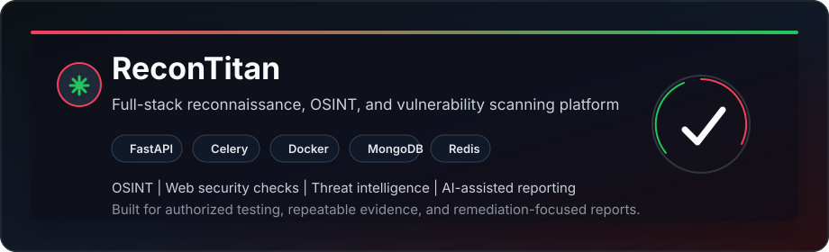

<div align="center">


# Hi, I'm Devansh Patel

**Cybersecurity enthusiast focused on offensive security, web application testing, OSINT, and practical automation.**


<br>

<a href="https://www.github.com/D3v4nshPat3l"></a>
<a href="https://www.linkedin.com/in/devansh-patel-5ab00a219/"></a>
<a href="https://tryhackme.com/p/ByteShell"></a>
<a href="https://v3n0m.medium.com/"></a>

<br>
<br>


<a href="https://github.com/D3v4nshPat3l?tab=followers"></a>


</div>

---

## About Me

```yaml
handle: D3v4nshPat3l
role: Cybersecurity Enthusiast | Penetration Testing Learner | CTF Player
focus: Web security, OSINT, recon automation, vulnerability validation
languages: Python, Bash, PowerShell, Go, Rust, C
platforms: Linux, Kali, Ubuntu, Windows, Docker, GitHub Actions
mindset: "Authorized testing, reproducible evidence, clear remediation."
```

- I build security tools that turn recon data into useful findings and readable reports.
- I practice web exploitation, Linux internals, network security, and CTF-style problem solving.
- I write notes, mini playbooks, and project documentation to make learning repeatable.
- I care about responsible disclosure, scoped testing, and practical fixes.

## Current Focus

| Track | What I am improving |
| --- | --- |
| Recon automation | Domain/IP intelligence, DNS, certificate transparency, screenshots, and reporting workflows |
| Web security | Authentication, authorization, input validation, headers, CORS, cookies, and API testing |
| CTF practice | Web, crypto, reverse engineering, forensics, privilege escalation, and pwn fundamentals |
| Documentation | Clear writeups with steps to reproduce, impact, evidence, and remediation |

## Featured Build

<div align="center">

<a href="https://github.com/D3v4nshPat3l/ReconTitan">
  
</a>

</div>

**ReconTitan** is my self-hosted reconnaissance and vulnerability scanning platform for OSINT, web security checks, threat intelligence enrichment, and AI-assisted reporting.

- FastAPI backend with modular scan tasks
- Celery workers, Redis queueing, MongoDB persistence, and Nginx reverse proxy
- WHOIS, DNS, crt.sh, Wayback, SSL/TLS, headers, CORS, cookies, WAF checks, and threat intel enrichment
- Report-focused output for both technical review and remediation planning

## Security Workflow

```text
scope -> recon -> enumerate -> validate -> document -> report -> harden -> repeat
```

| Phase | How I approach it |
| --- | --- |
| Scope | Confirm target boundaries, assumptions, and permission before testing |
| Recon | Collect passive and active signals without losing context |
| Validation | Reproduce findings, remove false positives, and capture evidence |
| Reporting | Explain impact, severity, reproduction steps, and realistic remediation |
| Hardening | Turn findings into configuration, code, or process improvements |

<div align="center">

## `// 04 - TECH STACK`

</div>

<table>
  <tr>
    <td align="right"><strong>LANGUAGES</strong></td>
    <td>
      
      
      
      
      
      
      
      
    </td>
  </tr>
  <tr>
    <td align="right"><strong>WEB &amp; API</strong></td>
    <td>
      
      
      
      
      
      
    </td>
  </tr>
  <tr>
    <td align="right"><strong>CLOUD &amp; DEVOPS</strong></td>
    <td>
      
      
      
      
      
      
      
    </td>
  </tr>
  <tr>
    <td align="right"><strong>PLATFORMS</strong></td>
    <td>
      
      
      
      
      
      
    </td>
  </tr>
  <tr>
    <td align="right"><strong>RECON &amp; OSINT</strong></td>
    <td>
      
      
      
      
      
      
      
      
      
    </td>
  </tr>
  <tr>
    <td align="right"><strong>WEB SECURITY</strong></td>
    <td>
      
      
      
      
      
      
      
      
    </td>
  </tr>
  <tr>
    <td align="right"><strong>EXPLOITATION</strong></td>
    <td>
      
      
      
      
      
      
      
    </td>
  </tr>
  <tr>
    <td align="right"><strong>FORENSICS &amp; REVERSING</strong></td>
    <td>
      
      
      
      
      
      
      
      
    </td>
  </tr>
  <tr>
    <td align="right"><strong>DEFENSE &amp; MONITORING</strong></td>
    <td>
      
      
      
      
      
      
    </td>
  </tr>
  <tr>
    <td align="right"><strong>CTF &amp; LABS</strong></td>
    <td>
      
      
      
      
      
    </td>
  </tr>
</table>

## GitHub Metrics

<div align="center">


<br>
<br>


<br>
<br>

<picture>
  <source media="(prefers-color-scheme: dark)" srcset="https://raw.githubusercontent.com/D3v4nshPat3l/D3v4nshPat3l/output/github-snake-dark.svg" />
  <source media="(prefers-color-scheme: light)" srcset="https://raw.githubusercontent.com/D3v4nshPat3l/D3v4nshPat3l/output/github-snake.svg" />
  
</picture>

</div>

## Learning Notes

- Web app security labs and vulnerability writeups
- Recon and OSINT checklists
- Linux privilege escalation notes
- Tooling experiments for repeatable security workflows

<div align="center">

<a href="https://v3n0m.medium.com/"></a>
<a href="https://github.com/D3v4nshPat3l?tab=repositories"></a>

</div>

## Open To Collaborate

- CTF teams and practice groups
- Beginner-friendly security tooling
- OSINT and recon automation projects
- Web security research, writeups, and lab notes
- Documentation-first security projects

<div align="center">

### Build. Break. Document. Improve.

<a href="https://www.linkedin.com/in/devansh-patel-5ab00a219/"></a>
<a href="https://github.com/D3v4nshPat3l"></a>
<a href="https://tryhackme.com/p/ByteShell"></a>

<br>
<br>

<sub>All security work shown here is for authorized testing, learning, and responsible research.</sub>

</div>
